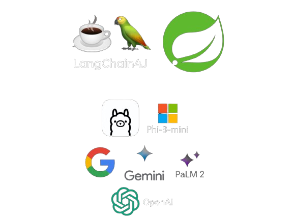

<h1 align="center">Java Retrieval-Augmented Generation Prototype</h1>

    

  Progetto di stage presso Sync Lab S.r.l.
     
     
  Retrieval-Augmented Generation con LangChain4J
     
  Large Language Model Phi-3 mini, GPT 3.5 Turbo, Gemini 1.5 Pro e PaLM 2 Bison
     
  Sviluppato con Java Spring

  

    

<h3 align="center">Come testare</h3>

    Dopo aver avviato l'applicazione, utilizzare Postman o simili per accedere agli endpoint per:
      
    Visualizzare i documenti in database, su cui poter fare domande:
     
    GET localhost:8080/api/documents
     
    Nessun parametro richiesto.
      
    Porgere una domanda:
     
    GET localhost:8080/api/ask
     
    Parametro testuale: domanda.
      
    Rimuovere un documento:
     
    DELETE localhost:8080/api/documents
     
    Parametro testuale: nome documento da rimuovre (nome.pdf)
      
    Aggiungere un documento (già presente in /resources):
     
    POST localhost:8080/api/documents
     
    Parametro testuale: nome documento da aggiungere (nome.pdf)

